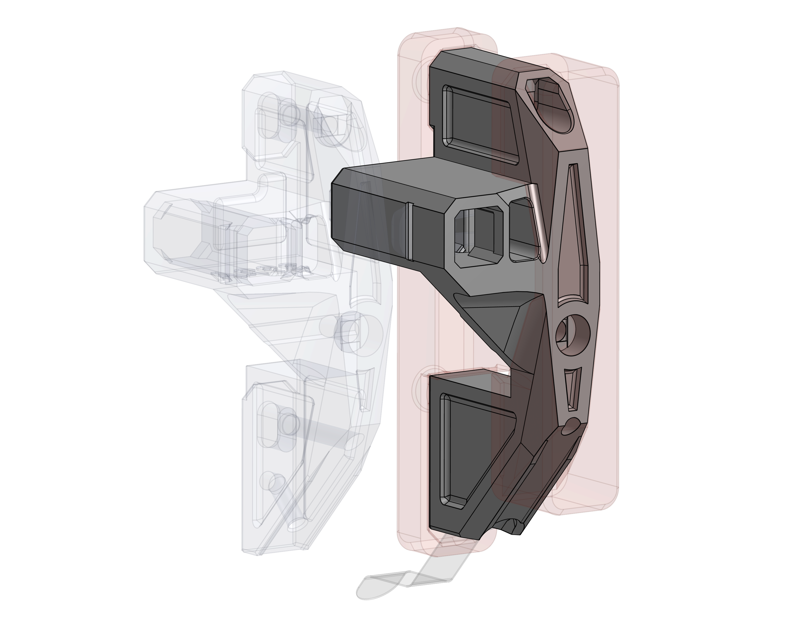

Imported dock from Bondtech's simplified geometry. Through a long series of cuts and small adjustments the dock was beefed up to fit on a 2020 extrusion. It still uses the same exact hardware and other printed parts, only the body was changed. ([Onshape source](https://cad.onshape.com/documents/78836e2fa75979653fb6a091/w/3316e982cf645299c83fd133/e/2c345297b517125cc0666689?renderMode=0&uiState=6a84608d37a557ef36d82366))

The dock has 5mm of additional thickness compared to the original 1515 dock to make it similarly sturdy. It has the same dimensions on all other axes.

There really isn't any reason to use this dock other than "I had a spare 2020 extrusion and didn't want to buy a 1515"

## Assembly

1. Snap both small magnets to a passive tool to get their correct orientation
2. Pick up one magnet and insert it into the magnet insertion tool
3. Triple check magnet orientation. Pointing the magnet towards the passive tool's magnets you should feel them repelling each other.
4. Use a pipe wrench to insert the magnet
5. After inserting both magnets, quadruple check the orientation (aka test-fit the passive tool)
6. Use the alignment tool to push down the magnets flush
7. Use a magnetic M3x6 SHCS to push the magnets down a few fractions of a millimeter more,
   so that the passive tool's magnets don't directly touch the dock's magnets anymore
