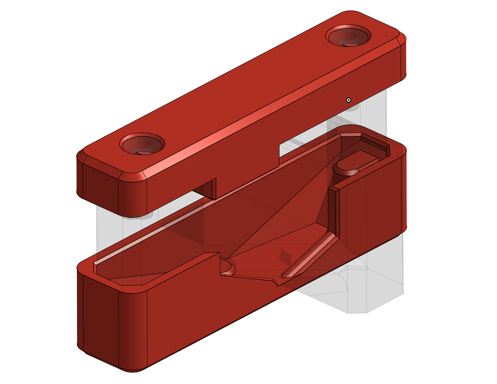

[Printables Source](https://www.printables.com/model/1761126-bondtech-indx-toolholder-magnet-tool)

Uses 2x M3x8 SHCS. If you don't want your life to be hell **USE MAGNETIC SCREWS**.

## Assembly

1. Screw out both magnet jig screws until they are just barely peeking out.
2. Snap both small magnets to a passive tool to get their correct orientation
3. Pick up one magnet and snap it onto the screw, **with the same side that previously attached to the dock**.
   You can imagine the jig as being a passive tool here.
4. **Triple check magnet orientation**. Pointing the magnet towards the passive tool's magnets you should feel them repelling each other.
5. Use a pipe wrench to press-fit the magnet just enough to where it holds by itself (doesn't fall out)
6. Quadruple check the orientation (aka test-fit the passive tool) **BEFORE FULLY PRESS-FITTING THE MAGNETS**
7. Iteratively fully-insert the magnets
   1. Screw the magnet in by 0.5-1mm
   2. Use a pipe wrench to press down the magnet fully
   3. Repeat until the screw is fully screwed in
8. Use a magnetic M3x6 SHCS to push the magnets down a few fractions of a millimeter more,
   so that the passive tool's magnets don't directly touch the dock's magnets anymore
9. Repeat for the second magnet
